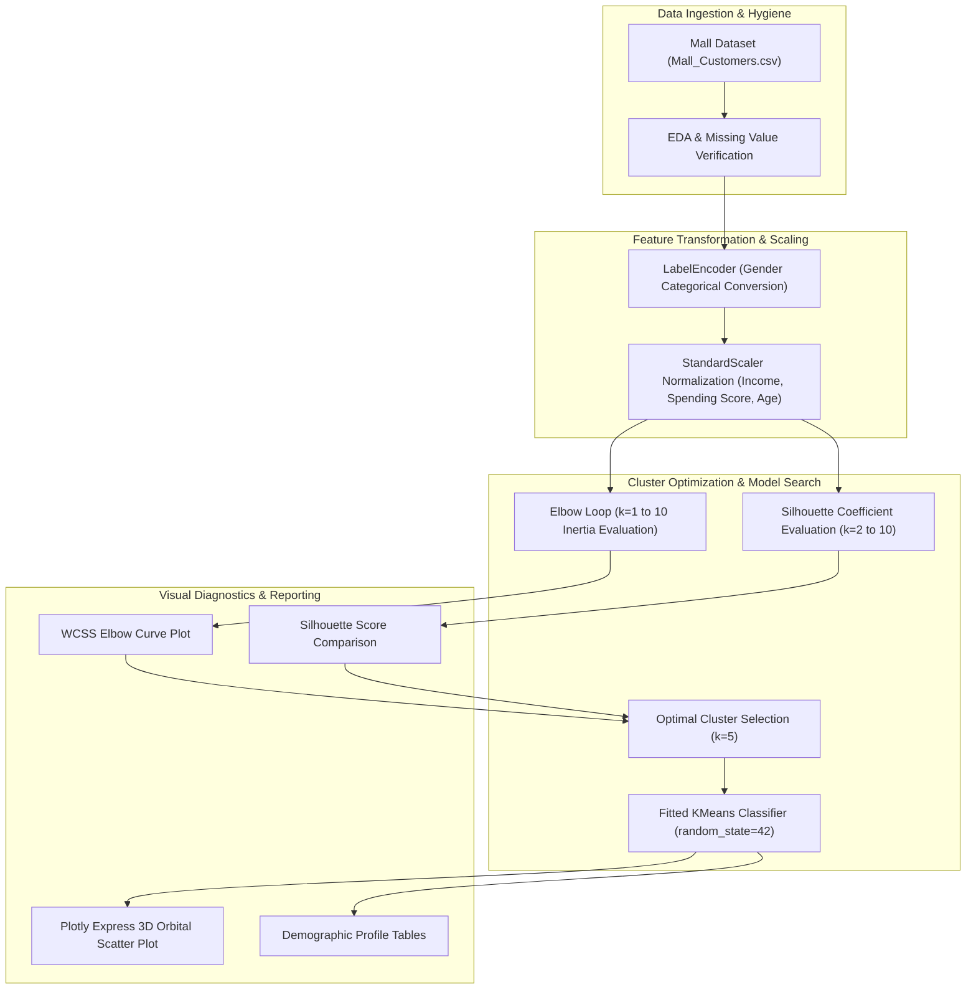

<br/><br/>

<!-- Animated Title -->
<p align="center">
  <a href="#">
    
  </a>
</p>

<p align="center">
  <b>Unsupervised Machine Learning & Behavioral Analytics Engine for Retail Customer Segmentation</b><br/>
  <i>K-Means Clustering · Within-Cluster Sum of Squares (Elbow Heuristic) · Silhouette Coefficient Optimization · 5-Tier Behavioral Personas · Interactive Plotly 3D Visualizations</i>
</p>

<br/>

<!-- Badges Row 1: Core Technologies -->
<p align="center">
  
  
  
  
  
</p>

<!-- Badges Row 2: Standards & Status -->
<p align="center">
  
  
  
  
  
</p>

<br/>

<!-- Quick Navigation Bar -->
<p align="center">
  <a href="#-overview"></a>
  &nbsp;
  <a href="#-problem-statement--retail-solution"></a>
  &nbsp;
  <a href="#-the-5-customer-personas"></a>
  &nbsp;
  <a href="#%EF%B8%8F-analytical-architecture"></a>
  &nbsp;
  <a href="#-clustering-mechanics--validation"></a>
  &nbsp;
  <a href="#-quickstart--execution"></a>
</p>

---

## 📌 Overview

**Mall Customer Segmentation** is an unsupervised machine learning study designed to uncover latent behavioral patterns and purchasing personas among retail shoppers. Without relying on pre-labeled historical tags, the platform groups customers based on their **Annual Income**, **Spending Score (1–100)**, and **Demographics**.

By synthesizing mathematical **Elbow Heuristics (Inertia minimization)** with **Silhouette Analysis**, the pipeline identifies the globally optimal cluster count ($k=5$). The resulting behavioral taxonomy allows retail executives, mall operators, and marketing teams to tailor promotional campaigns, optimize tenant positioning, and maximize customer lifetime value (LTV).

```
                      ┌────────────────────────────────────────────────────────┐
                      │              Customer Clustering Core                  │
                      │                                                        │
[ Mall Shoppers Data: ]─┼──> [ StandardScaler Normalization ]                   ├──> [ 5 Retail Personas ]
[ Income, Age, Score ]  │             │                                          │    - 🎯 Target VIPs (High Inc/High Spend)
                        │             ▼                                          │    - 🛡️ Careful Savers (High Inc/Low Spend)
                        │    [ K-Means Cluster Optimization ]                    │    - ⚖️ Balanced Shoppers (Mid Inc/Mid Spend)
                        │       ├── Elbow Curve (WCSS Inertia)                   │    - 🛍️ Careless Spenders (Low Inc/High Spend)
                        │       └── Silhouette Score Validation                  │    - 🪙 Budgeters (Low Inc/Low Spend)
                        │             │                                          │
                        │             ▼                                          │
                        │    [ Plotly Express 2D/3D Interactive Projections ]    │
                        └────────────────────────────────────────────────────────┘
```

---

## 🎯 Problem Statement & Retail Solution

<table>
<tr>
<td width="50%" valign="top">

### ❌ The One-Size-Fits-All Retail Trap

Traditional retail marketing treats foot traffic as a monolithic demographic:

- 📢 **Generic Blanket Discounts**: Blasting identical mass promotions dilutes luxury brand margins while ignoring price-sensitive shoppers.
- 📉 **Wasted Marketing Budget**: Premium products pitched to budget-constrained shoppers yield low conversion rates.
- 🕳️ **Unidentified VIPs**: High-income shoppers with low spending scores remain unengaged due to lack of customized concierge outreach.
- 📊 **High-Dimensional Concealment**: Intersections between income, age, and propensity to spend cannot be observed on 2D spreadsheets alone.

</td>
<td width="50%" valign="top">

### ✅ The Unsupervised ML Solution

| Challenge | Applied Engineering Solution |
| :--- | :--- |
| **Persona Discovery** | **K-Means Clustering** autonomously segments shoppers into mathematically distinct cohorts. |
| **Rigorous Cluster Validation** | Combines **Within-Cluster Sum of Squares (WCSS)** elbow testing with **Silhouette Coefficients**. |
| **Feature Normalization** | **StandardScaler** standardizes age, income, and spending scores into zero-mean, unit-variance coordinates. |
| **Dynamic Exploration** | **Plotly Express 3D scatter manifolds** enable orbital rotation and inspection of customer boundaries. |

</td>
</tr>
</table>

---

## 🔥 The 5 Customer Personas

The mathematically optimal $k=5$ clustering reveals five actionable retail archetypes:

| Cluster | Archetype | Income | Spending | Strategic Retail Action |
| :---: | :--- | :---: | :---: | :--- |
| **1** | **🎯 Target VIPs** | High | High | Exclusive concierge services, loyalty perks, private preview galas. |
| **2** | **🛡️ Careful Savers** | High | Low | Value-driven high-end marketing, investment-grade product storytelling. |
| **3** | **⚖️ Balanced Middle** | Moderate | Moderate | Seasonal promotions, cross-merchandising, family bundle deals. |
| **4** | **🛍️ Careless Spenders** | Low | High | Trend-driven impulse displays, social media virality, fast fashion. |
| **5** | **🪙 Conservative Budgeters** | Low | Low | Clearance sales, discount coupons, budget essentials. |

---

## 🏗️ Analytical Architecture



---

## 🔬 Clustering Mechanics & Validation

### 1. K-Means Mathematical Formulation
The objective function minimizes the within-cluster sum of squares (WCSS):
$$J = \sum_{j=1}^{k} \sum_{i=1}^{n_j} \|\mathbf{x}_i^{(j)} - \mathbf{c}_j\|^2$$
Where $\mathbf{c}_j$ denotes the centroid of cluster $j$.

### 2. Validation Metrics
- **Elbow Heuristic**: Plots inertia against $k \in [1, 10]$; the distinct "elbow" curvature point at $k=5$ marks optimal variance capture before diminishing returns.
- **Silhouette Coefficient**: Quantifies how well-separated cluster boundaries are, measuring intra-cluster cohesion versus nearest-neighbor separation ($s \in [-1, 1]$).

---

## ⚙️ Technical Stack

| Component | Technology | Purpose & Implementation |
| :--- | :--- | :--- |
| **Clustering Core** | **Scikit-Learn** | `KMeans`, `StandardScaler`, `LabelEncoder`, `silhouette_score` |
| **Interactive 3D Visuals** | **Plotly Express** | Hardware-accelerated 3D orbital scatter visualization |
| **Static Visualizations** | **Seaborn & Matplotlib** | Pairplots, distribution histograms, and elbow charts |
| **Data Manipulation** | **Pandas & NumPy** | Vectorized table wrangling and column indexing |
| **Notebook Environment** | **Jupyter Notebook** | Interactive 73-cell reproducible analysis |

---

## 📁 Repository Structure

```
Mall-Customer-Segmentation-/
├── 📄 mall-customers-segmentation.ipynb # Comprehensive 73-cell clustering notebook
├── 📊 Mall_Customers.csv              # Customer demographics, income & spending score dataset
└── 📄 README.md                        # Documentation
```

---

## 🚀 Quickstart & Execution

### Prerequisites
- **Python**: 3.10 or higher
- **Jupyter Notebook**: Recommended

---

### 1. Installation

```bash
# 1. Clone repository
git clone https://github.com/IbrahimAbdelsattar/Mall-Customer-Segmentation-.git
cd Mall-Customer-Segmentation-

# 2. Create virtual environment
python -m venv venv
source venv/bin/activate        # On Windows: .\venv\Scripts\activate

# 3. Install packages
pip install numpy pandas scikit-learn seaborn matplotlib plotly jupyter
```

---

### 2. Running the Notebook

```bash
jupyter notebook mall-customers-segmentation.ipynb
```

*Step through the notebook cells to generate the elbow curve, calculate silhouette scores, and interact with the 3D Plotly customer space.*

---

## 👥 Author & Connect

**Ibrahim Abdelsattar**  
*AI Engineer & Machine Learning Specialist*

- 🌐 **GitHub**: [@IbrahimAbdelsattar](https://github.com/IbrahimAbdelsattar)
- 💼 **LinkedIn**: [Ibrahim Abdelsattar](https://www.linkedin.com/in/ibrahim-abdelsattar/)
- 📧 **Email**: [ibrahimabdelsattar042@gmail.com](mailto:ibrahimabdelsattar042@gmail.com)

---

<p align="center">
  <sub>Engineered for retail analytics, customer intelligence, and unsupervised machine learning. © 2026 Mall Customer Segmentation.</sub>
</p>
